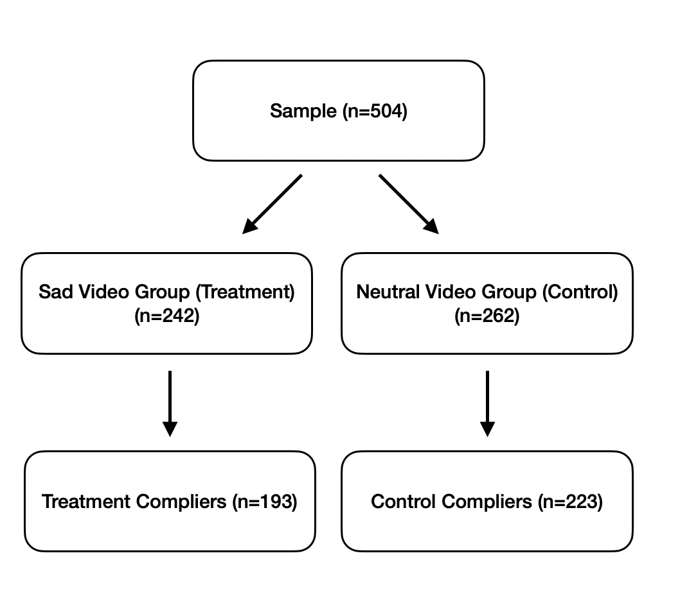

```{r libraries, include=FALSE, warning = FALSE}
library(data.table)
library(tidyverse)
library(janitor)
library(ggplot2)
library(dplyr)
library(patchwork)
library(tidyverse)
library(lmtest)
library(stargazer)
library(sandwich)
library(knitr)
```

```{r load data, include = FALSE, warning = FALSE}
d <- fread('../data/W241_Survey_Results_Clean.csv')
full_data <- fread('../data/full_data.csv')
```

```{r full data inspection, include = FALSE, warning = FALSE}
# checking out fishy responses from the full dataset
q_cols <- full_data %>% select(i_am_the_life_of_the_party:i_am_full_of_ideas) %>% names()

# convert to long format for easier counting
df_long <- melt.data.table(full_data, measure.vars = q_cols, variable.name = "question", value.name = "answer")

# 17 people basically put the same answer all the way down, with only slight variations
# save the IDs of these 17 people to filter out later
bad_ids <- df_long[,.N, by = c("response_id", "answer")][N >= 45]$response_id
```

```{r data cleaning, include = FALSE, warning = FALSE}
# define complier and treatment variables
d[, ":=" (
  complier = ifelse(((d[, dob_day] %% 2 == 1) & (d[, compliance_q_glass] == 'Confetti (colored)')) | 
                      ((d[, dob_day] %% 2 == 0) & (d[, compliance_q_mclaughlin] == 'Fish')), TRUE, FALSE), 
  
  treatment = ifelse(d[, dob_day] %% 2 == 0, 1, 0)
)]


# Binarize hispanic variable
d[, hispanic := ifelse(hispanic %in% c(1, 15), 0, 1)]

# make some vars more descriptive
d[, ':=' (
  
  # Simplify ethnicity breakdowns
  ethnicity = fcase(
    ethnicity == 1, "White", 
    ethnicity == 2, "Black or African American", 
    ethnicity %in% c(4, 5, 6, 7, 8, 9, 10), "Asian", 
    default = "Other"),
  
  region = fcase(
    region == 1, "Northeast", 
    region == 2, "Midwest", 
    region == 3, "South", 
    region == 4, "West", 
    default = "idk"), 
  
  education = fcase(
    education == 1, "Some high school or less",
    education == 2, "High school graduate",
    education == 3, "Other post high school vocational training",
    education == 4, "Completed some college, but no degree",
    education == 5, "Associate's degree",
    education == 6, "Bachelor's degree",
    education == 7, "Master's or professional degree",
    education == 8, "Doctorate degree",
    default = "idk"), 
  
  gender = ifelse(gender == 1, "Male", "Female")
  
  )]

# Create this variable just to compare with the other variable `how_old_are_you` and filter out discrepancies
d[, how_old_are_you2 := fcase(
  age >= 18 & age <= 24, "18-24 years old", 
  age >= 25 & age <= 34, "25-34 years old",
  age >= 35 & age <= 44, "35-44 years old",
  age >= 45 & age <= 54, "45-54 years old",
  age >= 55 & age <= 64, "55-64 years old",
  age >= 65, "65+ years old", 
  default = "idk"
)]

# consider cleaning hhi (household income) and political party


# more data cleaning
filtered_d <- d %>% 
  
  # filter out bad data. Can decide later what isn't necessary to filter out.
  # This shrinks the data size from 504 to 448
  filter(
    #complier == TRUE,  # 39 non-compliers
    duration_in_seconds <= 1000,  # 23 ppl took more than 1000 seconds and are outliers
    !(taken_test_before == 'Yes' & familiar_with_test == 'No'),  # 6 ppl not answering questions correctly
    (what_is_your_gender == gender), # 9 ppl answered their gender incorrectly
    how_old_are_you == how_old_are_you2,  # 22 ppl answered their age incorrectly
    response_id != bad_ids,  # 17 people answered 45/50 of the question with the same answer. (3 of which are non-compliers)
  ) %>% 
  
  # drop unnecessary vars
  # we didn't get recipient name info, everyone finished, and other vars are unnecessary
  select(-how_old_are_you2, -recipient_last_name:-external_data_reference, 
         -response_type, -progress, -finished, -distribution_channel, -user_language, -rid)


# separately make dataset of compliers only
filtered_compliers <- filtered_d %>% filter(complier)
```

# Abstract

How sensitive are personality test results to external stimuli, such as video and music? We conducted a study to investigate this question and identify the potential causal relationship between watching a sad video and personality test results. Our treatment group watched and listened to a short advertisement that is traditionally considered to evoke negative emotions, such as sadness, and our control group was provided with a neutral how-to documentary to watch. Both groups then answered a series of questions from the Five Factor Personality Test (FFPT), as well as additional questions about demographic covariates and “quiz questions” to identify compliers that actually watched the videos. We then evaluated the difference in quantitative scores across the five domains between treatment and control and determined that the treatment group scored significantly lower in the areas of agreeableness, extraversion, and neuroticism. While we may not be able to generalize these specific results to different video and music types or the larger U.S. population, these data imply that caution should be used when relying on “objective” personality tests in research as they are still prone to some subjective variation due to external factors.

# Research Question & Background

Personality tests are used widely by individuals looking to better understand themselves, how they react to situations, and their strengths and weaknesses. Because of this, having objective, unbiased personality tests is important in providing accurate results. However, many personality tests have been found to be subjective, with results swinging based on the test-taker’s current mood and emotions. In 1996, Heide et al. found that several personality measurement scales were unstable when groups of people were exposed to different emotion-evoking videos.[^1] This problem plagues the study of personality, causing many tests, such as Myers-Briggs, to be discarded in favor of more empirical and rigorously-developed personality tests, such as the Five Factor Personality Test (FFPT).[^2] 

Despite being considered the most scientifically robust personality test and a staple in personality research, the FFPT has even shown questionable results in experimental studies. In 2014, Querengässer et al. administered a personality test to experimental subjects twice over the course of one month: once with no treatment (the neutral state) and once in an emotional state, after exposure to positive or negatively associated films, songs, and memories.[^3] Subjects were asked to rate the strength of their happiness or sadness and then to complete a 60-question FFPT. Researchers measured and analyzed the difference between an individual’s scores for each of the five domains of the FFPT. These results suggest that a user’s emotional state influences personality test measures.[^3] However, we are investigating the sensitivity of this phenomenon: Can a *single* video influence mood and personality to such a degree that it is detectable via the FFPT?

In our experiment, we are interested in how a single video impacts the five factors tested and scored in the FFPT: agreeableness, extraversion, neuroticism, conscientiousness, and openness. Agreeableness describes the extent to which "a person puts others' interests and needs ahead of their own." Extraversion measures "how much a person is energized by the outside world." Neuroticism captures an individual's sensitivity "to stress and negative emotional triggers."[^4] Conscientiousness scores an individual's persistence, organization skills, and ambition. The final personality factor, openness, commonly referred to as "openness to experience," describes creativity and curiosity.[^5]

[^1]: Heide, M., Grønhaug, K. The impact of mood on personality measures. Qual Quant 30, 1–17 (1996). https://doi.org/10.1007/BF00139832
[^2]: Chen, A. How accurate are personality tests? Scientific American (Online). 08 Oct, 2018. Retrieved from https://www.scientificamerican.com/article/how-accurate-are-personality-tests/ 19 Sept 2021.
[^3]: Querengässer, J., Schindler, S. Sad but true? - How induced emotional states differentially bias self-rated Big Five personality traits. BMC Psychol 2, 14 (2014). https://doi.org/10.1186/2050-7283-2-14
[^4]: The Big Five Personality Test. Retrieved from https://www.truity.com/test/big-five-personality-test 1 Dec 2021.
[^5]: Paul Costa and Robert McCrae and the Five-Factor Model of Personality. (2020, August 16). Lansing Commnunity College. https://socialsci.libretexts.org/@go/page/12242


## Hypotheses

- Null hypothesis ($H_0$): There is no difference in personality score for any of the five personality traits from the FFPT between those that watch a sad Sarah McLachlan animal cruelty video and those that watch a video on glass blowing. 
- Alternative hypothesis ($H_a$): There is a difference in personality score for at least one of the five personality traits from the FFPT between those that watch a sad Sarah McLachlan animal cruelty video and those that watch a video on glass blowing. 
- Significance threshold ($\alpha$): 0.01

The FFPT is meant to be robust to temporary moods and measure one's true personality traits. However, we feel that one's responses might vary depending on their temporary mood at the time of the test.

To stay within the scope and budget of our research project, we decided a sad video on animal cruelty accompanied with sad Sarah McLachlan music would be the most effective at changing a participant's mood right before taking the FFPT. We also decided that a video demonstrating glass blowing would have a minimal impact on one's temporary mood. The sad video served as our treatment while the glass blowing video served as the placebo treatment. 

We used a two-sided alternative hypothesis given that we were unsure the direction of the treatment effect. Because we would test the treatment's impact five times (once for each personality trait), we used a Bonferroni correction to decrease the significance threshold to 0.01 to be conservative.

Before sending out our survey, we predicted that the treatment (the sad Sarah McLachlan video) would have the largest effect on subjects' neuroticism scores. Neurotic people tend to have a high emotional reaction to stress and are more likely to experience mood swings. Thus, we expected those scores to change the most with the treatment. We also predicted that the treatment would have a minimal effect on subjects' openness to experience scores. This personality trait seems the most unrelated to the sad video, and perhaps would hardly be swayed by this temporary mood change. 

# Experiment Details

## Experiment Design & Treatment

In order to conduct our experiment, we utilized Qualtrics as our medium for survey delivery. Subjects were first asked some demographics questions, and subsequently were either assigned to treatment or control, which we describe in detail in the next section. We also asked subjects ahead of taking the FFPT if they had either taken or were aware of the FFPT. We hypothesized that respondents already familiar with the test would be less sensitive to our treatment video, which is why we collected this information. Additionally, this allowed us to filter out potentially problematic subjects who responded that they were not familiar with the FFPT but had actually taken it before.

Next, the treatment group was asked to watch the sad video advertisement video for the American Society for the Prevention of Cruelty to Animals (ASPCA) featuring Sarah McLachlan. We selected this video as our treatment exposure since it is cited as one of the most commercially successful nonprofit donation fundraising campaigns of all time.[^6] The control/placebo group was exposed to a neutral video on glass blowing. In this fashion both groups would be exposed to short videos ahead of taking the FFPT.

After watching their respective videos, participants were asked to answer a compliance question that could only be answered if they had indeed watched the entire video. These questions were made easy enough to answer so as not to be prohibitive, but hard enough to ensure one could not fake their way through it. Additionally, before moving past the videos, there was a timer which was implemented in Qualtrics to ensure that the participant spent time actually watching the video before moving on. In this way, non-compliers were able to be detected and removed from the dataset if they answered the post-video question incorrectly. We did not use the results from the compliance question as a covariate in our analysis, instead only used it for filtering purposes.

Finally, all respondents took the FFPT, consisting of 50 questions. Each question allowed participants to rank how strongly they agreed or disagreed with a statement. After finishing all of the questions, subjects were able to submit their answers.

[^6]: Strom, Stephanie. “Ad Featuring Singer Proves Bonanza for the A.S.P.C.A.” The New York Times, The New York Times, 26 Dec. 2008, https://www.nytimes.com/2008/12/26/us/26charity.html. 

## Randomization Process

In order to split users into treatment and control groups randomly, we first asked them to provide us with their date of birth. If the subject was born on an even-numbered day of the month, they would be selected into the treatment group (i.e., shown the ASPCA video with Sarah McLachlan). If, on the other hand, the subject had an odd-numbered birthdate they were put into the control group (i.e., shown  the neutral glass blowing video). We chose this method because we expected it to provide an unbiased and even split of our survey participants.

After carrying-out the randomization process, we found that there was a sufficiently random and equal split between the treatment and control groups.

## Comparison of Potential Outcomes

The potential outcomes for this investigation were the treated and untreated personality factor scores for each of the 
five factors within the FFPT: extraversion, neuroticism, openness to experience, agreeableness, and conscientiousness. That is,
each factor was measured for both those exposed to the sad video, and those exposed to the neutral video. In doing so, we were able to 
measure each of the potential outcomes for our project. Each of these factors is measured on a scale from 0 to 40 through the FFPT. 
Therefore, by analysing the changes to these factor values, we were able to 
compare potential outcomes.

## Power Calculation 

Before conducting our research, we ran a power analysis to determine how many survey participants we would need for our study. After taking the test ourselves, we conservatively concluded that a standard deviation of 15 and treatment effect of 3 was appropriate for each personality score. The power analysis concluded statistical significance if any one of the five factor personality tests showed a difference in score that produced a p-value less than our significance threshold of 0.01. 

The graph in figure 1 shows how the power increases with sample size. After conducting the test, we calculated a power of .83 at 400 participants, and .89 at 500 participants. Given this information, we sought ways to find between 400 and 500 participants to complete our survey. 

We used Lucid's platform called Lucid Theorem[^7]$^\text{,}$[^8] to collect 504 survey responses total. We discarded 56 responses due to data discrepancies and 32 responses did not comply with the treatment. This left us with 416 survey responses that we feel answered questions correctly and complied with the treatment. More information about our data filtering and cleaning can be found in the Appendix. Given the adequate power of our study with 416 reliable survey responses, we have more confidence in the accuracy of our results.

[^7]: https://luc.id/
[^8]: https://lucidtheorem.com/

```{r power analysis, echo=FALSE, warning=FALSE, fig.height=3, fig.cap = "Power Analysis"}
# function to run one power test
# i run a regression on each factor individually
# recommended to set the alpha to .05/5 for bonferonni adjustment
power_analysis_one_test <- function(samp_size = 50, treatment_split = .5, 
                                    force_even_split = T, tau = -5, factor_mean = 50, 
                                    factor_sd = 10, alpha = .01){
  
  # sample ppl and put them into treatment or control. Depends on if we want even splits or not
  if (force_even_split){
    df <- data.table(condition = c(rep("treatment", round(samp_size/2,0)), rep("control", round(samp_size/2,0))))
  }else{
    df <- data.table(condition = sample(c("treatment", "control"), size = samp_size, replace = T))
  }
  
  # now sample from the normal distribution to assign the treatment effect. 
  # if they are in treatment, they get the added "tau" effect. 
  # control just gets rnorm()
  for (i in 1:5){
    df[, paste0("factor", i) := ifelse(condition == "treatment", 
                                       rnorm(nrow(df[condition == "treatment",]), factor_mean + tau, factor_sd),
                                       rnorm(nrow(df[condition == "control",]), factor_mean, factor_sd)
    )]
  }
  
  # finally, calculate p-value for every personality factor
  pvals <- c()
  for (i in 1:5){
    fit <- summary(lm(as.formula(paste0("factor", i, "~ condition")), data = df))
    pval <- fit$coefficients[2,4]
    pvals <- c(pvals, pval)
  }
  
  # are any of them significant?
  sig <- sum(pvals < alpha) > 0
  
  # return boolean for if it's significant or not
  return(sig)
  
}


# Changing the sample size and running the experiment 1,000 times at various sample sizes and calculating the power. 
adjust_sample_size <- function(samp_sizes, iter=1000, verbose=F){
  
  output_samp_size <- c()
  for (i in samp_sizes){
    output_samp_size <- c(output_samp_size, 
                          mean(sapply(1:iter, function(x) power_analysis_one_test(
                            samp_size = i, treatment_split = .5, force_even_split = T, 
                            tau = 3, factor_mean = 50, factor_sd = 15))))
    if(verbose){
      print(paste0("Sample size ", i, " done."))
    }
    
  }
  
  df_out <- data.table(
    sample_size = samp_sizes,
    power = output_samp_size
  )
  
  return(df_out)
}


# for speed, i've commented out the adjust_sample_size(), and just put the results
set.seed(1)
#df1 <- adjust_sample_size(seq(50, 500, 50), iter=300)
df1 <- read_csv(
"sample_size,power
50,0.1266667
100,0.2300000
150,0.3266667
200,0.4600000
250,0.5500000
300,0.6733333
350,0.7400000
400,0.8333333
450,0.8700000
500,0.8933333")

# plot
df1 %>%
  ggplot(aes(x = sample_size, y = power)) +
  geom_line() +
  labs(title = "Power as Sample Size Increases",
       subtitle = "Assumes test scores have a standard deviation of 15, with a treatment effect of 3",
       y = "Power", x = "Sample Size") +
  theme_minimal()

# optional code to save the plot image
#ggsave("~/Desktop/plot.png", height=2, width=5)
```


# Analysis

## Data

For each of the 504 survey participants, we collected survey metadata, demographic data, and their responses to the 50 FFPT questions. Some of the covariates were explicitly asked in our Qualtrics survey while others were provided to us from the survey respondents' profiles on Lucid. Not every covariate listed below was used in our analysis but was available if we needed. We've outlined the information collected in the survey below.

- Survey metadata:
  - Start and end date
  - IP Address
  - Survey progress out of 100%
  - Duration in seconds
  - Time taken for their first and last survey question clicks
- Survey questions:
  - Compliance "quiz" question to determine whether the participant complied with the treatment
  - Whether or not the participant was assigned treatment or control
  - 50 FFPT survey questions (outcome being measured)
- Covariates:
  - Age grouped into 7 factor levels
  - Month of birthday
  - Gender
  - Highest level of education grouped into 8 factor levels
  - Whether or not the participant has taken the FFPT before
  - Whether or not the participant is familiar with the FFPT
  - Household income grouped into 24 factor levels
  - Ethnicity grouped into 4 factor levels
  - Hispanic
  - Political party
  - Region: west, midwest, south, and northeast
  - Granular location info: latitude, longitude, and zip code
  
### CONSORT Document

We designed the experiment to have two parts: a video followed by a survey. Participants with odd birthday dates were assigned the Sarah McLachlan video (n=242), and participants with even birthday dates were assigned the neutral glass blowing video (n=262). After watching the video, the participants were assigned to complete The Five Factor Personality Test.

{#id .class width=50% height=50%}

### Scoring methodology

When filling out the survey, participants were asked whether they disagree, slightly disagree, feel neutral, slightly agree, or agree with 50 questions about their personality. These answers were converted to a numeric scale ranging from 1 to 5. Each of these numeric scores either positively or negatively impact the final score towards a personality trait. In the end, each of these scores were added up and rescaled to have a minimum possible score of 0 and maximum score of 40. These scores were then compared between treatment and control groups to determine significance.

## Data Cleaning and Filtering

The original dataset included 504 observations with 94 variables. These variables consisted of the responses to the 50 FFPT survey questions, demographic data provided by Lucid, demographic data provided by Qualtrics, and some additional technical metadata from Qualtrics such as timestamps. 

To begin, we renamed the columns to have more user-friendly names. We then went through every column and checked the data for reasonableness and searched for situations where we couldn't trust the responses. 

First, we found several participants that answered "Neutral" for every FFPT question--these users were not used in the final analysis. Users with the same answer across 45 of the 50 FFPT questions were filtered from our final dataset.

Second, we leveraged the demographic data that we collected in addition to the Lucid-provided data to check for consistency. For example, we asked respondents for their gender in our Qualtrics survey, but Lucid also provided this same data. After comparing the two, we found that for a few responses the two gender answers were different. We then performed a similar analysis for age. To ensure we had accurate data, we dropped respondents whose demographic data was not consistent across the Lucid-provided data and the data we collected.

Third, while the vast majority of survey respondents finished the survey in less than 15 minutes, a few took far longer to respond, causing a skewed distribution in completion time. We dropped those who took more than 1,000 seconds (16.67 minutes) to respond, which caused the distribution to be much more normal. We chose 1,000 seconds as a threshold because Lucid Theorem required our survey to have a maximum completion time of 15 minutes. Rounding up to 1,000 seconds allowed for some extra buffer time just in case users needed some additional time to complete the survey.

Finally, we collected data on respondents' familiarity with the FFPT and whether or not they had taken the test before. Logically, it would not make sense for an individual to be unfamiliar with FFPT but respond as having taken the test before. We dropped these individuals from our analysis as well.

For additional data cleaning, we simplified several of the demographic covariates provided by Lucid. For example, the ethnicity and Hispanic covariates each contained 16 sub-categories. Lucid Theorem provided a variable mapping, which allowed us to simplify these few complex factor levels. We simplified ethnicity into four sub-categories (white, Black, Asian, other) and Hispanic into a binary variable.

### Data Details and Covariate Checks

After discarding the 56 responses due to data discrepancies, we were left with 448 subjects in our dataset. Thirty two of these subjects were non-compliers. The table below shows the breakdown of treatment vs control for both the compliers and non-compliers. 

```{r, include = FALSE}
complier_xtabs <- xtabs(~ complier + treatment, data = filtered_d)
#gender_xtabs <- prop.table(xtabs(~ what_is_your_gender + treatment, data = d))
```

<!-- COMPLIERS TABLE -->

\begin{table}[!htbp] \centering 
  \caption{Compliers in treatment and control before filtering} 
  \label{} 
\begin{tabular}{@{\extracolsep{5pt}} ccccccc} 
\\[-1.8ex]\hline 
\hline \\[-1.8ex] 
 & Control & Treatment  \\ 
\hline \\[-1.8ex] 
Complier & `r complier_xtabs[2, 1]` & `r complier_xtabs[2, 2]`\\ 
Noncomplier & `r complier_xtabs[1, 1]` & `r complier_xtabs[1, 2]` \\ 
\hline \\[-1.8ex] 
Total & `r complier_xtabs[2, 1] + complier_xtabs[1, 1]` (`r round((complier_xtabs[2, 1] + complier_xtabs[1, 1])*100 / (complier_xtabs[2, 1] + complier_xtabs[1, 1] + complier_xtabs[2, 2] + complier_xtabs[1, 2]), 2)`\%) & `r complier_xtabs[2, 2] + complier_xtabs[1, 2]` (`r round((complier_xtabs[2, 2] + complier_xtabs[1, 2])*100 / (complier_xtabs[2, 1] + complier_xtabs[1, 1] + complier_xtabs[2, 2] + complier_xtabs[1, 2]), 2)`\%) \\
\end{tabular} 
\end{table}

<!-- END COMPLIERS TABLE -->

Next, we conducted covariate checks to check the distribution of covariates between our treatment and control groups. 

Table 2 shows the output of the treatment assignment regressed on the covariates used in our models. Covariates showing a significant impact on whether the subject received treatment or control could indicate a potential covariate imbalance. 

After runing the test, we see that those in age group 18-24 years old show a significant impact at the .05 significance level on whether one receives treatment or control. To investigate further, we created a bar chart in figure 3 to show the breakdown of treatment vs control at every age group. Only 2 subjects were in the age group under 18--due to the small number of participants in this group, we can ignore the imbalance for these two subjects. However, only 31% received treatment of those in age group 18-24. Because this age group had `r d[how_old_are_you=="18-24 years old", .N]` subjects, this imbalance might be concerning.

Based on the regression results and barchart, there does appear to be a slight imbalance of treatment vs control for those in age group 18-24. When we randomized subjects into treatment or control, we did not do so with any dependence on their age. Thus, we believe this imbalance is due to random chance. 

```{r, echo = FALSE, results = 'asis'}
d2 <- d
age_levels <- c("Under 18", "18-24 years old", "25-34 years old", "35-44 years old", 
                                        "45-54 years old", "55-64 years old", "65+ years old")
d2$how_old_are_you <- factor(d2$how_old_are_you, 
                             levels =age_levels)

edu_levels <- c("Less than high school degree", "High school diploma or GED", "Some college but no degree",
                "Associate degree in college (2-year)", "Bachelor's degree in college (4-year)", "Master's degree",
                "Professional degree (JD, MD)", "Doctoral degree")
d2$education_highest <- factor(d2$education_highest, levels=edu_levels)

eth_levels <- c("Other", "Asian", "Black or African American", "White")
d2$ethnicity <- factor(d2$ethnicity, levels=eth_levels)


covar_balance_fit <- lm(treatment ~ how_old_are_you + 
     gender + education_highest + region + familiar_with_test + 
     taken_test_before + ethnicity + hispanic, data=d2)

stargazer(covar_balance_fit, type='latex', dep.var.labels="Treatment", 
          covariate.labels=c(age_levels[-1], "Male", edu_levels[-1], "Region - Northeast", "Region - South", "Region - West", 
                             "Familiar with test before", "Taken test before", 
                             eth_levels[-1], "Hispanic"), 
          omit.stat = c("f", "ser"), 
          title="Covariate Balance Checks", single.row = TRUE, header=FALSE)

```


```{r, echo=FALSE, fig.height=4, fig.cap = "Treatment Assignment by Age"}
df2 <- d2[,.N, by = c("how_old_are_you", "treatment")][order(how_old_are_you, treatment)] %>% 
  left_join(d2[,.(total = .N), by = how_old_are_you], by = "how_old_are_you") %>% 
  mutate(percent = round(N/total, 4), 
         Group = ifelse(treatment==1, "Treatment", "Control"))
df2 <- data.frame("how_old_are_you" = "Under 18",  "treatment" = 0, "N" = 0, "total" = 2, "percent" = 0, "Group" = "Control") %>%
  rbind(df2) %>% data.table()
df2$how_old_are_you <- factor(df2$how_old_are_you, levels = age_levels)

ggplot(df2) + 
  geom_bar(aes(x = how_old_are_you, y = N, fill=Group), position='fill', stat='identity') +
  scale_y_continuous(labels = scales::percent_format()) + 
  scale_fill_manual(values = c(rgb(0/255, 50/255, 98/255), rgb(253/255, 181/255, 21/255))) + 
  theme_minimal() + 
  theme(axis.text.x = element_text(angle = 30, hjust = .7), legend.position = "bottom") + 
  labs(title = "Treatment vs Control at Every Age Group",
       x = "Age", y = "Treatment Percentage", fill="") + 
  annotate("text", x = 1:7, y = (df2[treatment==1]$percent)/2, 
           label = paste0(round(df2[treatment==1]$percent*100,0),"%"), colour = "black") +
  annotate("text", x = 2:7, y = 1-(df2[treatment==0 & how_old_are_you != "Under 18"]$percent)/2, 
           label = paste0(round(df2[treatment==0 & how_old_are_you != "Under 18"]$percent*100,0),"%"), colour = "white")

```


## Models

Using the cleaned and filtered data, we created models to estimate the average treatment effect of the Sarah McLachlan ASPCA video on the five personality types. Our models estimated the intent to treat effect (ITT) and the average treatment effect on the treated (ATET) since we administered a placebo video for those who in our control group. We drew conclusions primarily from the ATET but additionally show as an example that without the placebo, our estimates would have been biased. When creating models, we started with simple models, regressing only the personality outcomes on the treatment, and then modeled the outcomes additionally using covariate data we collected. 

### Simple Models

In our simple models, we regressed each personality type on a binary variable indicating if someone was assigned to the treatment group. We estimated the ITT for all subjects in the experiment and the ATET for compliers. Additionally, we applied robust standard errors in all of our models to account for any heteroskedasticity in the data.

```{r itt simple models, include = FALSE, warning = FALSE}
# Use filtered_d for creating the ITT models since this data does not filter out compliers
a_itt_simple <- filtered_d[, lm(personality_a ~ treatment)] # agreeableness
c_itt_simple <- filtered_d[, lm(personality_c ~ treatment)] # conscientiousness
e_itt_simple <- filtered_d[, lm(personality_e ~ treatment)] # extraversion
n_itt_simple <- filtered_d[, lm(personality_n ~ treatment)] # neuroticism
o_itt_simple <- filtered_d[, lm(personality_o ~ treatment)] # openness
```

```{r atet simple models, include = FALSE, warning = FALSE}
# Use filtered_compliers for creating the ATET models since this data is filtered to only compliers
a_atet_simple <- filtered_compliers[, lm(personality_a ~ treatment)] # agreeableness
c_atet_simple <- filtered_compliers[, lm(personality_c ~ treatment)] # conscientiousness
e_atet_simple <- filtered_compliers[, lm(personality_e ~ treatment)] # extraversion
n_atet_simple <- filtered_compliers[, lm(personality_n ~ treatment)] # neuroticism
o_atet_simple <- filtered_compliers[, lm(personality_o ~ treatment)] # openness
```

```{r robust SEs for simple models, include = FALSE, warning = FALSE}
# Define robust standard errors for ITT simple models
a_itt_simple_se <- sqrt(diag(vcovHC(a_itt_simple, type = "HC1")))
c_itt_simple_se <- sqrt(diag(vcovHC(c_itt_simple, type = "HC1")))
e_itt_simple_se <- sqrt(diag(vcovHC(e_itt_simple, type = "HC1")))
n_itt_simple_se <- sqrt(diag(vcovHC(n_itt_simple, type = "HC1")))
o_itt_simple_se <- sqrt(diag(vcovHC(o_itt_simple, type = "HC1")))

# Define robust standard errors for ATET simple models
a_atet_simple_se <- sqrt(diag(vcovHC(a_atet_simple, type = "HC1")))
c_atet_simple_se <- sqrt(diag(vcovHC(c_atet_simple, type = "HC1")))
e_atet_simple_se <- sqrt(diag(vcovHC(e_atet_simple, type = "HC1")))
n_atet_simple_se <- sqrt(diag(vcovHC(n_atet_simple, type = "HC1")))
o_atet_simple_se <- sqrt(diag(vcovHC(o_atet_simple, type = "HC1")))
```


The ATETs in these models indicate that extraversion and neuroticism were significantly impacted by the Sarah McLachlan video. As shown in table 4, the treatment video reduced the amount someone is extraverted by `r round(coeftest(e_atet_simple, vcov. = vcovHC(e_atet_simple, type = "HC1"))[2, 1], 2)` on average with a standard error of `r round(coeftest(e_atet_simple, vcov. = vcovHC(e_atet_simple, type = "HC1"))[2, 2], 2)`. Similarly, the treatment video reduced an individual's level of neuoticism by `r round(coeftest(n_atet_simple, vcov. = vcovHC(n_atet_simple, type = "HC1"))[2, 1], 2)` on average with a standard error of `r round(coeftest(n_atet_simple, vcov. = vcovHC(n_atet_simple, type = "HC1"))[2, 2], 2)`. The treatment variable on these two models have p-values less than 0.01, which we used as our Bonferroni-corrected threshold for significance. Agreeableness is moderately significant, but not enough to meet this threshold. 

The simple models demonstrate the benefit of using a placebo design and having the ability to calculate the ATET instead of only the ITT. If we only had data to calculate the ITT, we would have incorrectly stated the significance level of agreeableness and openness. The ITT values for these personality types indicate that the treatment video did have a significant impact for agreeableness and a moderately significant impact for openness. The table showing our results with ITT is included in the Appendix. 

```{r stargazer table for simple ATET models, echo = FALSE, warning = FALSE, results = 'asis'}
stargazer(a_atet_simple, c_atet_simple, e_atet_simple, n_atet_simple, o_atet_simple,
            type = 'latex', 
            se = list(a_atet_simple_se, c_atet_simple_se, e_atet_simple_se,
                      n_atet_simple_se, o_atet_simple_se),
            add.lines = list(c("Covariates?", "No", "No", "No", "No", "No"),
                             c("Treatment p value", 
                               signif(coeftest(a_atet_simple)[2, 4], digits = 3),
                               signif(coeftest(c_atet_simple)[2, 4], digits = 3), 
                               signif(coeftest(e_atet_simple)[2, 4], digits = 3),
                               signif(coeftest(n_atet_simple)[2, 4], digits = 3),
                               signif(coeftest(o_atet_simple)[2, 4], digits = 3))),
            dep.var.labels = c("Agreeableness", "Conscientiousness", 
                              "Extraversion", "Neuroticism",
                              "Openness"),
            covariate.labels = c("Treatment", "Constant"),
            omit.stat = c("f", "ser"),
            star.cutoffs = c(0.05, 0.01, 0.001),
            title = 'Simple Model ATET Results for Compliers',
            header = FALSE)
```

### Models with Covariates

We then created models using the additional covariates that may influence personality type. The covariates we included in our model are age, gender, highest education, region, ethnicity, Hispanic, "familiar with test," and "taken test before."
  
```{r itt cov models, include = FALSE, warning = FALSE}
# Create models with covariates using filtered_d

# Agreeableness
a_itt_cov <- filtered_d[, lm(personality_a ~ treatment + how_old_are_you + 
                               gender + education_highest + region + 
                               familiar_with_test + taken_test_before +
                               ethnicity + hispanic)] 
# Conscientiousness
c_itt_cov <- filtered_d[, lm(personality_c ~ treatment + how_old_are_you + 
                               gender + education_highest + region + 
                               familiar_with_test + taken_test_before +
                               ethnicity + hispanic)]

# Extraversion
e_itt_cov <- filtered_d[, lm(personality_e ~ treatment + how_old_are_you + 
                               gender + education_highest + region + 
                               familiar_with_test + taken_test_before +
                               ethnicity + hispanic)]

# Eeuroticism
n_itt_cov <- filtered_d[, lm(personality_n ~ treatment + how_old_are_you + 
                               gender + education_highest + region + 
                               familiar_with_test + taken_test_before +
                               ethnicity + hispanic)] 

# Openness
o_itt_cov <- filtered_d[, lm(personality_o ~ treatment + how_old_are_you + 
                               gender + education_highest + region + 
                               familiar_with_test + taken_test_before +
                               ethnicity + hispanic)] 
```

```{r atet cov models, include = FALSE, warning = FALSE}
# Create models with covariates using  filtered_compliers

# Agreeableness
a_atet_cov <- filtered_compliers[, lm(personality_a ~ treatment + how_old_are_you + 
                                        gender + education_highest + region + 
                                        familiar_with_test + taken_test_before +
                                        ethnicity + hispanic)]

# Conscientiousness
c_atet_cov <- filtered_compliers[, lm(personality_c ~ treatment + how_old_are_you + 
                                        gender + education_highest + region + 
                                        familiar_with_test + taken_test_before +
                                        ethnicity + hispanic)] 

# Extraversion
e_atet_cov <- filtered_compliers[, lm(personality_e ~ treatment + how_old_are_you + 
                                        gender + education_highest + region + 
                                        familiar_with_test + taken_test_before +
                                        ethnicity + hispanic)] 

# Neuroticism
n_atet_cov <- filtered_compliers[, lm(personality_n ~ treatment + how_old_are_you + 
                                        gender + education_highest + region + 
                                        familiar_with_test + taken_test_before +
                                        ethnicity + hispanic)] 

# Openness
o_atet_cov <- filtered_compliers[, lm(personality_o ~ treatment + how_old_are_you + 
                                        gender + education_highest + region + 
                                        familiar_with_test + taken_test_before +
                                        ethnicity + hispanic)] 
```
  
```{r robust SEs for covariate models, include = FALSE, warning = FALSE}
# Define robust standard errors for ITT models with covariates
a_itt_cov_se <- sqrt(diag(vcovHC(a_itt_cov, type = "HC1")))
c_itt_cov_se <- sqrt(diag(vcovHC(c_itt_cov, type = "HC1")))
e_itt_cov_se <- sqrt(diag(vcovHC(e_itt_cov, type = "HC1")))
n_itt_cov_se <- sqrt(diag(vcovHC(n_itt_cov, type = "HC1")))
o_itt_cov_se <- sqrt(diag(vcovHC(o_itt_cov, type = "HC1")))

# Define robust standard errors for ATET models with covariates
a_atet_cov_se <- sqrt(diag(vcovHC(a_atet_cov, type = "HC1")))
c_atet_cov_se <- sqrt(diag(vcovHC(c_atet_cov, type = "HC1")))
e_atet_cov_se <- sqrt(diag(vcovHC(e_atet_cov, type = "HC1")))
n_atet_cov_se <- sqrt(diag(vcovHC(n_atet_cov, type = "HC1")))
o_atet_cov_se <- sqrt(diag(vcovHC(o_atet_cov, type = "HC1")))
```

```{r stargazer table for ATET models with covariates, echo = FALSE, warning = FALSE, results = 'asis'}
stargazer(a_atet_cov, c_atet_cov, e_atet_cov, n_atet_cov, o_atet_cov,
            type = 'latex', 
            se = list(a_atet_cov_se, c_atet_cov_se, e_atet_cov_se,
                      n_atet_cov_se, o_atet_cov_se),
            omit = c("how_old_are_you", "gender", "education_highest", 
                     "familiar_with_test", "taken_test_before",
                    "ethnicity", "political_party", "region", "hispanic"),
            add.lines = list(c("Covariates?", "Yes", "Yes", "Yes", "Yes", "Yes"),
                             c("Treatment p value", 
                               signif(coeftest(a_atet_cov)[2, 4], digits = 3),
                               signif(coeftest(c_atet_cov)[2, 4], digits = 3), 
                               signif(coeftest(e_atet_cov)[2, 4], digits = 3),
                               signif(coeftest(n_atet_cov)[2, 4], digits = 3),
                               signif(coeftest(o_atet_cov)[2, 4], digits = 3))),
            dep.var.labels = c("Agreeableness", "Conscientiousness", 
                              "Extraversion", "Neuroticism",
                              "Openness"),
            covariate.labels = c("Treatment", "Constant"),
            omit.stat = c("f", "ser"),
            star.cutoffs = c(0.05, 0.01, 0.001),
            title = 'Model ATET Results for Compliers Using Covariates',
            header = FALSE)
```

In general, the precision in our estimates increased when we included covariates in our models. The new significance levels and covariate estimates are included in table 4. The significance of neuroticism and agreeableness both increased. Without covariates, neuroticism was only significant at the 1% level. Whereas after including covariates, neuroticism became significant at the 0.1% level. Similarly, agreeableness changed from being marginally significant to significant after including covariates with its p-value decreasing below our 1% threshold. The significance level of extraversion was not impacted, and conscientiousness and openness remained insignificant.

Similar to our simple models, we observed that using the ATET was advantageous compared to the ITT. The ITT models with covariates indicated marginal significance (p-value less than 0.05) for openness and extraversion, significance (p-value less than 0.01) for agreeableness, and high significance for neuroticism (p-value less than 0.001). Both openness and extraversion had incorrect significance results using the ITT, further demonstrating the value in our placebo design. These full ITT results are included in the Appendix.

### Model Results Discussion

Based on all the models we created, we drew conclusions from our models that estimate the ATET using covariates. These models are more precise than the simple models and are also unbiased, unlike our ITT models. We conclude that the Sarah McLachlan ASPCA video had a significant impact on three of the five personality types: agreeableness, extraversion, and neuroticism. On average, the treatment video decreased compliers' scores for agreeableness, extraversion, and neuroticism by `r round(coeftest(a_atet_cov, vcov. = vcovHC(a_atet_cov, type = "HC1"))[2, 1], 2)*-1` (`r round(coeftest(a_atet_cov, vcov. = vcovHC(a_atet_cov, type = "HC1"))[2, 2], 2)`), `r round(coeftest(e_atet_cov, vcov. = vcovHC(e_atet_cov, type = "HC1"))[2, 1], 2)*-1` (`r round(coeftest(e_atet_cov, vcov. = vcovHC(e_atet_cov, type = "HC1"))[2, 2], 2)`), and `r round(coeftest(n_atet_cov, vcov. = vcovHC(n_atet_cov, type = "HC1"))[2, 1], 2)*-1` (`r round(coeftest(n_atet_cov, vcov. = vcovHC(n_atet_cov, type = "HC1"))[2, 2], 2)`) points, respectively, with each ATET's standard error included in parentheses.

Table 5 demonstrates the effectiveness of deploying our placebo design and utilizing covariates in our analysis. The table shows our full results for openness. The models that do not filter out noncompliers consistently estimate the ITT as -1.2, which is marginally significant (p-value less than 0.05). However, this estimate is biased. When we do filter out noncompliers and estimate the ATET, we calculate the treatment effect to be -1.0, which is not significant. Additionally, adding covariates successfully decreased the standard error for our treatment effect estimates for both the models estimating ITT and the models estimating ATET.

```{r openness cross-model comparison, echo = FALSE, results = 'asis', warning = FALSE}
stargazer(o_itt_simple, o_atet_simple, o_itt_cov, o_atet_cov,
            type = 'latex', 
            se = list(o_itt_simple_se, o_atet_simple_se, 
                      o_itt_cov_se, o_atet_cov_se),
            omit = c("how_old_are_you", "gender", "education_highest", 
                     "familiar_with_test", "taken_test_before",
                     "ethnicity", "political_party", "region", "hispanic"),
            add.lines = list(c("Covariates?", "No", "No", "Yes", "Yes"),
                             c("Treatment p value", 
                               signif(coeftest(o_itt_simple)[2, 4], digits = 3),
                               signif(coeftest(o_atet_simple)[2, 4], digits = 3), 
                               signif(coeftest(o_itt_cov)[2, 4], digits = 3),
                               signif(coeftest(o_atet_cov)[2, 4], digits = 3))),
            column.labels = c("ITT", "ATET", "ITT", "ATET"),
            dep.var.labels = "Openness",
            covariate.labels = c("Treatment", "Constant"),
            omit.stat = c("f", "ser"),
            star.cutoffs = c(0.05, 0.01, 0.001),
            title = paste('Model Comparison for Openness'),
            header = FALSE)
```

# Conclusions
  
In this experiment, we tested whether and how much mood impacting external stimuli can impact an individual's results on a personality test. By running regressions on 416 responses from our Qualtrics survey, we concluded that our treatment video, Sarah McLachlan's 2007 ASPCA commercial, had a significant impact on three factors of the Five Factor Personality Test: agreeableness, extraversion, and neuroticism. Each of these factors had a significantly lower value in our treatment group than control group. 

However, our study had several limitations preventing us from generalizing to all populations and across longer time periods. As discussed throughout this paper, covariate checks, while approximately balanced between treatment and control, led us to believe that our sample demographics may be different compared to the large adult U.S. population. This was most notable in the distribution of household income among our survey respondents. For this reason, we believe the results of this study may not be generalizable to the larger U.S. population. Additionally, our valid respondents completed the survey in under 1,000 seconds (16.67 minutes), so while we concluded there was a significant effect on personality in this time period, we are uncertain how long this treatment effect lasts. Finally, we performed this experience using only one treatment video. It is likely that different videos will have different effects on personality, so we cannot generalize our specific ATET results to all sad videos. Future experiments should focus on reproducibility and generalizability, which would address these key limitations and lend additional confidence to our conclusions.

Despite these limitations, these results cause us to view personality tests like the FFPT more skeptically. The FFPT in particular is supposed to lack subjectiveness that plagues other personality tests. However, our results indicated that an individual's short-term mood will cause them to score differently on the FFPT. When evaluating personality, it will be important to keep in mind that FFPT results may not tell the full story about an individual's personality.

\newpage

# Appendix

## ITT Model Results

```{r stargazer table for simple ITT models, echo = FALSE, warning = FALSE, results = 'asis'}
stargazer(a_itt_simple, c_itt_simple, e_itt_simple, n_itt_simple, o_itt_simple,
            type = 'latex', 
            se = list(a_itt_simple_se, c_itt_simple_se, e_itt_simple_se,
                      n_itt_simple_se, o_itt_simple_se),
            add.lines = list(c("Covariates?", "No", "No", "No", "No", "No"),
                             c("Treatment p value", 
                               signif(coeftest(a_itt_simple)[2, 4], digits = 3),
                               signif(coeftest(c_itt_simple)[2, 4], digits = 3), 
                               signif(coeftest(e_itt_simple)[2, 4], digits = 3),
                               signif(coeftest(n_itt_simple)[2, 4], digits = 3),
                               signif(coeftest(o_itt_simple)[2, 4], digits = 3))),
            dep.var.labels = c("Agreeableness", "Conscientiousness", 
                              "Extraversion", "Neuroticism",
                              "Openness"),
            covariate.labels = c("Treatment", "Constant"),
            omit.stat = c("f", "ser"),
            star.cutoffs = c(0.05, 0.01, 0.001),
            title = 'Simple Model ITT Results for All Participants',
            header = FALSE)
```

```{r stargazer table for ITT models with covariates, echo = FALSE, warning = FALSE, results = 'asis'}
stargazer(a_itt_cov, c_itt_cov, e_itt_cov, n_itt_cov, o_itt_cov,
            type = 'latex', 
            se = list(a_itt_cov_se, c_itt_cov_se, e_itt_cov_se,
                      n_itt_cov_se, o_itt_cov_se),
            omit = c("how_old_are_you", "gender", "education_highest", 
                     "familiar_with_test", "taken_test_before",
                    "ethnicity", "political_party", "region", "hispanic"),
            add.lines = list(c("Covariates?", "Yes", "Yes", "Yes", "Yes", "Yes"),
                             c("Treatment p value", 
                               signif(coeftest(a_itt_cov)[2, 4], digits = 3),
                               signif(coeftest(c_itt_cov)[2, 4], digits = 3), 
                               signif(coeftest(e_itt_cov)[2, 4], digits = 3),
                               signif(coeftest(n_itt_cov)[2, 4], digits = 3),
                               signif(coeftest(o_itt_cov)[2, 4], digits = 3))),
            dep.var.labels = c("Agreeableness", "Conscientiousness", 
                              "Extraversion", "Neuroticism",
                              "Openness"),
            covariate.labels = c("Treatment", "Constant"),
            omit.stat = c("f", "ser"),
            star.cutoffs = c(0.05, 0.01, 0.001),
            title = 'Model ITT Results for All Participants Using Covariates',
            header = FALSE)
```

## Model Comparisons for All Personality Types

```{r agreeableness cross-model comparison, echo = FALSE, results = 'asis', warning = FALSE}
stargazer(a_itt_simple, a_atet_simple, a_itt_cov, a_atet_cov,
            type = 'latex', 
            se = list(a_itt_simple_se, a_atet_simple_se, 
                      a_itt_cov_se, a_atet_cov_se),
            omit = c("how_old_are_you", "gender", "education_highest", 
                     "familiar_with_test", "taken_test_before",
                     "ethnicity", "political_party", "region", "hispanic"),
            add.lines = list(c("Covariates?", "No", "No", "Yes", "Yes"),
                             c("Treatment p value", 
                               signif(coeftest(a_itt_simple)[2, 4], digits = 3),
                               signif(coeftest(a_atet_simple)[2, 4], digits = 3), 
                               signif(coeftest(a_itt_cov)[2, 4], digits = 3),
                               signif(coeftest(a_atet_cov)[2, 4], digits = 3))),
            column.labels = c("ITT", "ATET", "ITT", "ATET"),
            dep.var.labels = "Agreeableness",
            covariate.labels = c("Treatment", "Constant"),
            omit.stat = c("f", "ser"),
            star.cutoffs = c(0.05, 0.01, 0.001),
            title = paste('Model Comparison for Agreeableness'),
            header = FALSE)
```

```{r conscientiousness cross-model comparison, echo = FALSE, results = 'asis', warning = FALSE}
stargazer(c_itt_simple, c_atet_simple, c_itt_cov, c_atet_cov,
            type = 'latex', 
            se = list(c_itt_simple_se, c_atet_simple_se, 
                      c_itt_cov_se, c_atet_cov_se),
            omit = c("how_old_are_you", "gender", "education_highest", 
                     "familiar_with_test", "taken_test_before",
                     "ethnicity", "political_party", "region", "hispanic"),
            add.lines = list(c("Covariates?", "No", "No", "Yes", "Yes"),
                             c("Treatment p value", 
                               signif(coeftest(c_itt_simple)[2, 4], digits = 3),
                               signif(coeftest(c_atet_simple)[2, 4], digits = 3), 
                               signif(coeftest(c_itt_cov)[2, 4], digits = 3),
                               signif(coeftest(c_atet_cov)[2, 4], digits = 3))),
            column.labels = c("ITT", "ATET", "ITT", "ATET"),
            dep.var.labels = "Conscientiousness",
            covariate.labels = c("Treatment", "Constant"),
            omit.stat = c("f", "ser"),
            star.cutoffs = c(0.05, 0.01, 0.001),
            title = paste('Model Comparison for Conscientiousness'),
            header = FALSE)
```

```{r extraversion cross-model comparison, echo = FALSE, results = 'asis', warning = FALSE}
stargazer(e_itt_simple, e_atet_simple, e_itt_cov, e_atet_cov,
            type = 'latex', 
            se = list(e_itt_simple_se, e_atet_simple_se, 
                      e_itt_cov_se, e_atet_cov_se),
            omit = c("how_old_are_you", "gender", "education_highest", 
                     "familiar_with_test", "taken_test_before",
                     "ethnicity", "political_party", "region", "hispanic"),
            add.lines = list(c("Covariates?", "No", "No", "Yes", "Yes"),
                             c("Treatment p value", 
                               signif(coeftest(e_itt_simple)[2, 4], digits = 3),
                               signif(coeftest(e_atet_simple)[2, 4], digits = 3), 
                               signif(coeftest(e_itt_cov)[2, 4], digits = 3),
                               signif(coeftest(e_atet_cov)[2, 4], digits = 3))),
            column.labels = c("ITT", "ATET", "ITT", "ATET"),
            dep.var.labels = "Extraversion",
            covariate.labels = c("Treatment", "Constant"),
            omit.stat = c("f", "ser"),
            star.cutoffs = c(0.05, 0.01, 0.001),
            title = paste('Model Comparison for Extraversion'),
            header = FALSE)
```

```{r neuroticism cross-model comparison, echo = FALSE, results = 'asis', warning = FALSE}
stargazer(n_itt_simple, n_atet_simple, n_itt_cov, n_atet_cov,
            type = 'latex', 
            se = list(n_itt_simple_se, n_atet_simple_se, 
                      n_itt_cov_se, n_atet_cov_se),
            omit = c("how_old_are_you", "gender", "education_highest", 
                     "familiar_with_test", "taken_test_before",
                     "ethnicity", "political_party", "region", "hispanic"),
            add.lines = list(c("Covariates?", "No", "No", "Yes", "Yes"),
                             c("Treatment p value", 
                               signif(coeftest(n_itt_simple)[2, 4], digits = 3),
                               signif(coeftest(n_atet_simple)[2, 4], digits = 3), 
                               signif(coeftest(n_itt_cov)[2, 4], digits = 3),
                               signif(coeftest(n_atet_cov)[2, 4], digits = 3))),
            column.labels = c("ITT", "ATET", "ITT", "ATET"),
            dep.var.labels = "Neuroticism",
            covariate.labels = c("Treatment", "Constant"),
            omit.stat = c("f", "ser"),
            star.cutoffs = c(0.05, 0.01, 0.001),
            title = paste('Model Comparison for Neuroticism'),
            header = FALSE)
```


## Sample Results with All Covariates

```{r stargazer table for appendix, echo = FALSE, warning = FALSE, results = 'asis'}
stargazer(a_atet_cov,
            type = 'latex', 
            se = list(a_atet_cov_se),
            add.lines = list(c("Covariates?", "Yes"),
                             c("Treatment p value", 
                               signif(coeftest(a_atet_cov)[2, 4], digits = 3))),
            dep.var.labels = c("Agreeableness"),
            covariate.labels = c("Treatment", "Constant"),
            omit.stat = c("f", "ser"),
            star.cutoffs = c(0.05, 0.01, 0.001),
            title = 'Sample Agreeableness ATET Model Showing All Covariates',
            header = FALSE,
          no.space = TRUE,
          font.size = "small")
```


