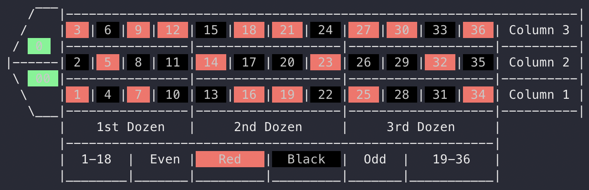
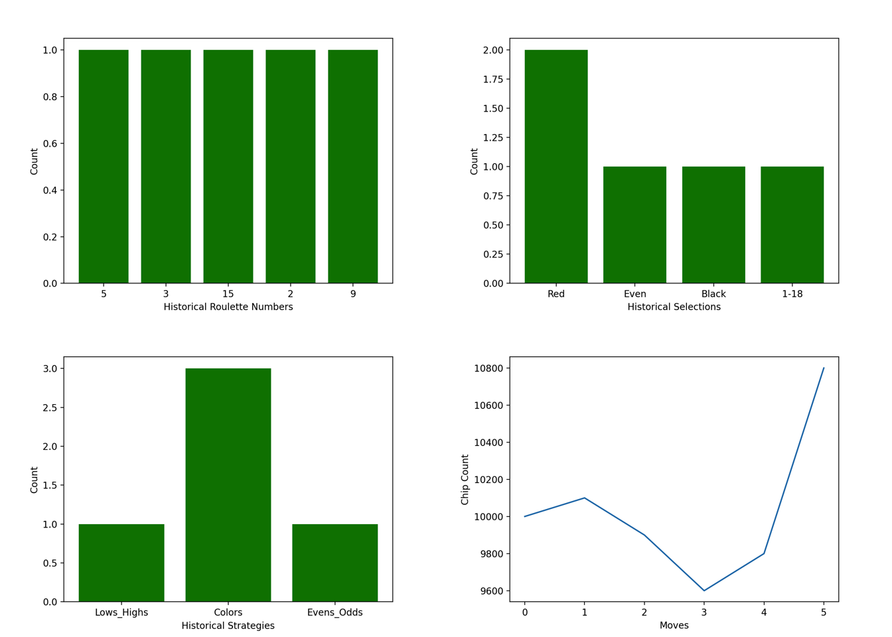

# About

During a class I took at Berkeley, I designed an application to simulate a roulette game. The application is written in an object oriented programming structure.

Feel free to download the `roulette.py` script in this repo and run the program to test it out. 

# Steps to run the simulator

To start the game, you simply run the python script from the command line:

```
python3 roulette.py
```

## Player Info

The game then asks for some player info such as name, date of birth, and chip count. The player can just keep pressing enter to accept the defaults. But, there is a hidden Easter egg in the game: the letters in your name and number in your birthdate will influence the probabilities on the roulette wheel.

```
Get ready to gamble!
Next I will ask for some player info.
If you don't want to enter any player info, just keep pressing 'enter' to accept default values.
Press enter to continue.


What is your name? Trevor
Enter DOB (any numeric format seperated by '-' or '/'): 1/30
How many chips do you want to buy (default = 1,000)? 10000
```

## Choose Action

Next, you’ll be asked to choose an action. Let’s select option 4 and choose to gamble.

```
Welcome to the roulette table.
What would you like to do?
1: Start over and re-define player attributes
2: View history (chip counts, and historical results)
3: Quit
4: Gamble!
```

## Roulette Table

After selecting option 4, we get additional options for gambling strategies. There’s also a table printout to help you make a selection. When pasting the table text below, it did not render the colors. Thus, I’ve taken a screenshot of what you would see in your commandline.




```
Take a look at the roulette table
Press enter to continue
Pick a gambling strategy. Type just one of the numbers below to select:

1: Straight-up (any number 1-36, '0', or '00') [PAYOUT = 35:1]
2: Split (any 2 numbers side by side) [PAYOUT = 17:1]
3: Street (any 3 numbers in a row) [PAYOUT = 11:1]
4: Six Line (a group of 6 numbers in 2 rows side by side) [PAYOUT = 5:1]
5: Columns (Horizontal long column) [PAYOUT = 2:1]
6: Dozens (1-12, 13-24, 25-36) [PAYOUT = 2:1]
7: Lows/Highs (half table) (1-18, 19-36) [PAYOUT = 1:1]
8: Colors (red, black) [PAYOUT = 1:1]
9: Evens/Odds [PAYOUT = 1:1]
```

## Place Bets

After choosing a gambling strategy, you can place your bets. I chose to gamble $100 on evens. The wheel landed on 2, so I profited $100.

```
Enter wager amount:
100
Evens/Odds. Select an option:

1: Evens
2: Odds
1

You win!
Roulette wheel result: 2
You wagered 100 chips
Your payout: 100
Your profit: 100
New chip count: 10100

Press enter to continue
```

## View History

After gambling several times, we can go back to the main menu and select a new option. Let’s take a look at the player history (option 2)

```
Welcome to the roulette table.
What would you like to do?
1: Start over and re-define player attributes
2: View history (chip counts, and historical results)
3: Quit
4: Gamble!
```

## Historical Plots

We can see 4 different graph types. The screenshots below show all the different options.

```
Select graph type:
1: Spin History
2: Strategy History
3: Selection History
4: Chip History
5: Go back
```



## Quit

Finally, the game ends when you run out of chips, or select the “Quit” option from the main menu.


